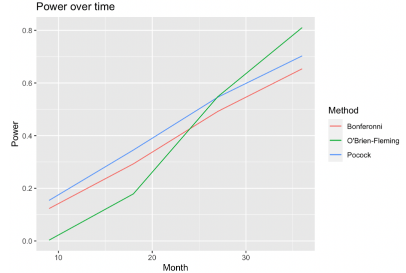
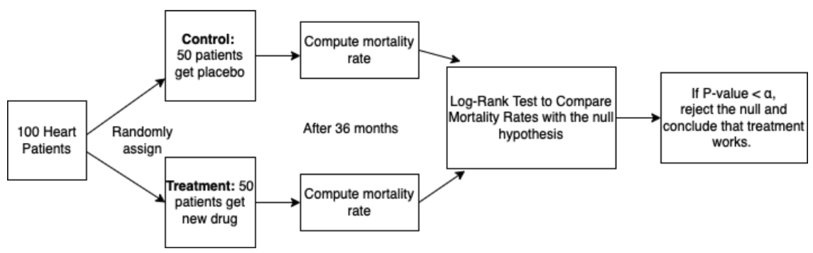
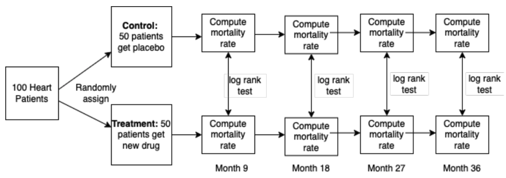
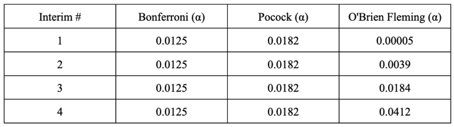

# Statistics DRP: Clinical Trials

This project investigates the statistics behind clinical trial design, culminating in an analysis of the Beta-Blocker Heart Attack Trial.

I completed this work in Winter 2022 with Anna Neufeld with the UW Statistics Department. Thank you Anna for being an amazing mentor and UW Statistics for organizing the Directed Reading Program!

## Summary

A clinical trial is a special type of statistical research study, which looks at how new medical interventions work (or don't work) on people. This project began open-ended, with the goal to explore the statistics behind effective clinical trial design and analysis, and to gain familiarity with R. The first few weeks involved reading the textbook and verifying concepts by running R simulations. I studied the basics of clinical trials, including potential ethical concerns, study populations, sample sizes, and types of trial designs. 

<figure style="display: flex; flex-direction: column; justify-content: center; align-items: center; padding: 0.5rem;">
  
  <figcaption style="padding-top: 0.5rem;" >A Simple Clinical Trial</figcaption>
</figure>

The question of early stopping became one of interest to me -- at what point do we have enough benefits or adverse effects to make a conclusion and cut a trial short. I read about group sequential methods, and simulated three sequential methods (Bonferroni, Pocock, and O'Brien Fleming) on the family-wise error rate, and the power over each interim.

<figure style="display: flex; flex-direction: column; justify-content: center; align-items: center; padding: 0.5rem;">
  
  <figcaption style="padding-top: 0.5rem;" >A Clinical Trial with Interim Analysis</figcaption>
</figure>

I then applied these methods to assess a real-world clinical trial: The Beta-Blocker Heart Attack Trials. Before the mid-1970s, β-Blockers were commonly used to treat those with heart disease, especially after a recent heart attack. However, due to small sample sizes, limitations of design/analysis, etc., researchers could not draw conclusive results on its effectiveness. The Beta-Blocker Heart Attack Trials were designed to test whether propranolol hydrochloride would cause a significant reduction in mortality to those who had recently had a heart attack over a 2-4 year period. It was one of the first clinical trials to use an O-F error correction, and stopped 9 months ahead of schedule as they found significant results early on. This begs the question: Did they make a mistake in choosing O'Brien Fleming?

To check whether OF was the appropriate boundary, and the likelihood of stopping 9 months early, I ran a simulation of 2000 trials using data from the BHAT trial with the different sequential method boundaries. The OF boundary had LOW power in the beginning (meaning hard to stop early at the start), but that the chance of stopping correctly grows and grows over time. Meanwhile, Bonferroni/Pocock are more consistent -- a good amount of power at the beginning (first interim analyses), but gets passed by OF as the # interims grow.

<figure style="display: flex; flex-direction: column; justify-content: center; align-items: center; padding: 0.5rem;">
  
  <figcaption style="padding-top: 0.5rem;" >Comparing methods for Beta-Blocker Heart Attack Trial</figcaption>
</figure>

The question of what sequential boundary to use depends on how willing you are to forgo power (accuracy) for initial treatments. If you want to stop early, such as in cancer treatment, then the Pocock method might be preferred. If you'd prefer more data before stopping, such as for stomachaches or less invasive conditions, the O'Brien Fleming boundary is preferred.

<figure style="display: flex; flex-direction: column; justify-content: center; align-items: center; padding: 0.5rem;">
  
  <figcaption style="padding-top: 0.5rem;" >Comparison of alpha spending methods for 4 interim analyses</figcaption>
</figure>

Given that there was already prior data, I understand why they chose OF. However, given the wealth of evidence before and after the trial confirming Beta-Blocker's effectiveness, I would have encouraged the researchers to use the Pocock method.

## Credits
* Special thanks to Anna Neufeld for her guidance in this project. You rock!

